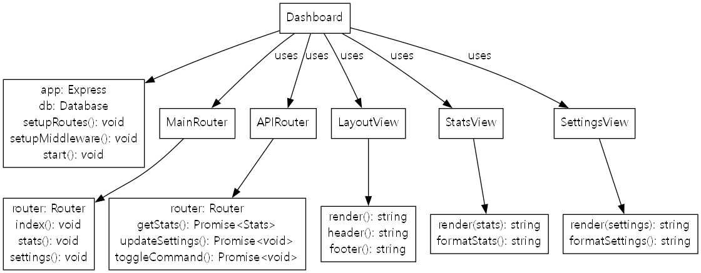

# 디스코드 봇 with AI (쵸코릴리봇)

> ⚠️ 이 프로젝트는 Cursor AI를 사용하여 생성되었으며, 직접 작성한 코드는 없습니다.
> 이 README.md 파일도 Cursor AI에 의해 자동으로 생성되었습니다.

## 프로젝트 소개
이 프로젝트는 Discord 봇과 대시보드를 포함한 웹 애플리케이션입니다. 봇은 가위바위보 게임을 지원하며, 대시보드를 통해 봇의 설정을 관리할 수 있습니다.

## 주요 기능
- **가위바위보 게임**
  - 봇과 대결 가능 (미쿠, 테토, 카후)
  - 랭킹 시스템
  - 승률 및 전적 기록

- **대시보드**
  - 서버별 명령어 활성화/비활성화
  - 랭킹 확인
  - 실시간 통계

- **기타 명령어**
  - `/운세` - 오늘의 운세를 알려줍니다.
  - `/타로` - 과거, 현재, 미래를 나타내는 타로 카드 3장을 뽑아 해석해줍니다.
  - `/주사위` - 다양한 형식의 주사위를 굴립니다.

## 기술 스택
- **Backend**
  - Node.js
  - TypeScript
  - Express.js
  - Discord.js

- **Frontend**
  - EJS
  - Bootstrap
  - Chart.js

- **Database**
  - JSON 파일 기반 (LowDB)

## 설치 및 실행 방법

### 기본 설치
1. 저장소 클론
```bash
git clone [repository-url]
cd discord_bot_with_ai
```

2. 의존성 설치
```bash
npm install
```

3. 환경 변수 설정
`.env` 파일을 생성하고 다음 내용을 추가:
```
DISCORD_TOKEN=your_discord_bot_token
CLIENT_ID=your_client_id
GUILD_ID=your_guild_id
```

### 실행 방법
- 일반 실행
```bash
npm start
```

- 개발 모드 실행 (자동 재시작)
```bash
npm run dev
```

### 봇 초대하기
1. [Discord Developer Portal](https://discord.com/developers/applications)에서 새 애플리케이션 생성
2. Bot 탭에서 봇 생성
3. OAuth2 탭에서 URL Generator로 초대 링크 생성
   - Scopes: `bot`, `applications.commands`
   - Bot Permissions: `Send Messages`, `Read Messages`, `Embed Links` 등

## 프로젝트 구조
```
discord_bot_with_ai/
├── src/
│   ├── commands/        # 디스코드 명령어
│   ├── dashboard/       # 대시보드 관련 파일
│   ├── utils/          # 유틸리티 함수
│   ├── events/         # 디스코드 이벤트 핸들러
│   ├── types/          # TypeScript 타입 정의
│   ├── asset/          # 이미지, 아이콘 등 리소스
│   └── index.ts        # 메인 파일
├── data/               # 데이터베이스 파일
└── config.json         # 설정 파일
```

## UML 다이어그램

### 봇 클래스 구조


봇의 클래스 구조는 다음과 같이 구성되어 있습니다:

- **Client**: 봇의 메인 클래스로, Discord 클라이언트와 명령어 컬렉션을 관리합니다.
  - Discord.js 클라이언트 인스턴스
  - 명령어 컬렉션
  - 데이터베이스 연결
  - 웹 대시보드 서버
  - 설정 관리

- **명령어 클래스들**:
  - `RPSCommand`: 가위바위보 게임 처리
  - `FortuneCommand`: 운세 보기 기능
  - `TarotCommand`: 타로 카드 해석
  - `DiceCommand`: 주사위 굴리기

- **유틸리티 클래스들**:
  - `Database`: 데이터베이스 작업 처리
  - `Config`: 봇 설정 관리

### 대시보드 클래스 구조


웹 대시보드의 클래스 구조는 다음과 같습니다:

- **Dashboard**: 대시보드의 메인 클래스
  - Express 애플리케이션
  - 데이터베이스 연결
  - 라우트 설정
  - 미들웨어 설정

- **라우터 클래스들**:
  - `MainRouter`: 메인 페이지 및 기본 라우트 처리
  - `APIRouter`: API 엔드포인트 처리

- **뷰 클래스들**:
  - `LayoutView`: 기본 레이아웃 템플릿
  - `StatsView`: 통계 데이터 표시
  - `SettingsView`: 설정 관리 인터페이스

### 명령어 실행 시퀀스


명령어 실행 과정은 다음과 같은 순서로 진행됩니다:

1. **사용자 입력**: 사용자가 Discord 채널에 명령어 입력
2. **Discord API**: 명령어를 봇 서버로 전달
3. **봇 서버**: 명령어를 받아 적절한 핸들러로 전달
4. **명령어 핸들러**: 명령어 처리 및 데이터베이스 작업 수행
5. **데이터베이스**: 필요한 데이터 조회/저장
6. **응답 전송**: 처리 결과를 사용자에게 전송
7. **대시보드 연동**: 웹 대시보드를 통한 설정 관리

이 구조를 통해 봇과 대시보드가 효율적으로 상호작용하며, 사용자에게 다양한 기능을 제공할 수 있습니다.

## 라이선스
MIT License